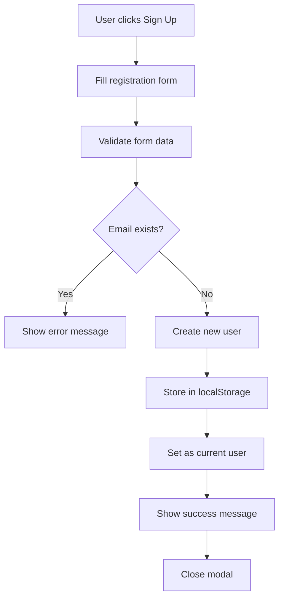
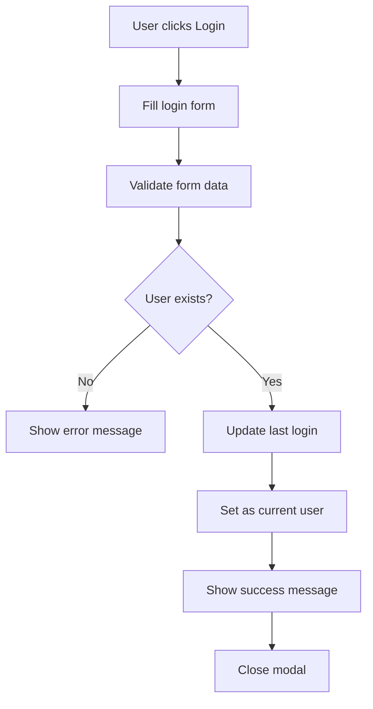
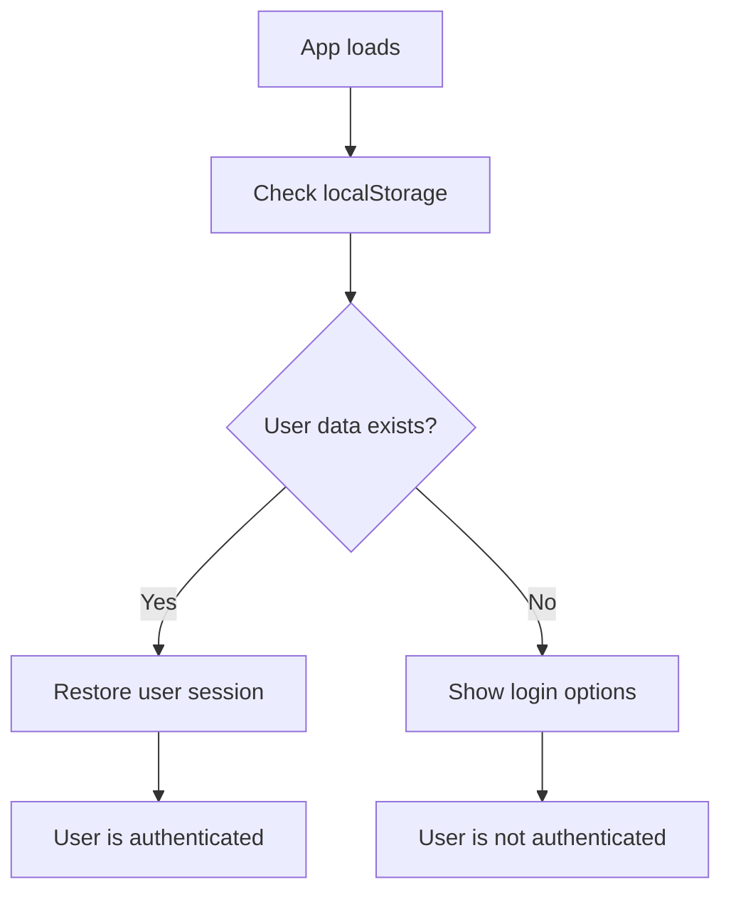

# 🔐 Authentication System with localStorage

## 📋 Table of Contents

- [Overview](#overview)
- [Features](#features)
- [Architecture](#architecture)
- [Implementation Details](#implementation-details)
- [User Flow](#user-flow)
- [Security Considerations](#security-considerations)
- [Testing Guide](#testing-guide)
- [Future Enhancements](#future-enhancements)

## 🌟 Overview

The KiwiVale Farm authentication system provides a complete user management solution using **localStorage for data persistence** and **React Context for state management**. This system allows users to create accounts, log in, and maintain their session across browser refreshes.

## ✨ Features

### **🔐 Authentication Features**
- ✅ **User Registration** - Create new accounts with email validation
- ✅ **User Login** - Secure login with email/password
- ✅ **Session Persistence** - Stay logged in across browser refreshes
- ✅ **User Logout** - Secure logout functionality
- ✅ **Profile Management** - View and manage user information
- ✅ **Duplicate Prevention** - Prevent multiple accounts with same email

### **💾 Data Storage**
- ✅ **localStorage Integration** - Persistent user data storage
- ✅ **User Data Management** - Store user profiles and credentials
- ✅ **Session Management** - Track login sessions and timestamps
- ✅ **Data Validation** - Form validation and error handling

### **🎨 User Experience**
- ✅ **Responsive Design** - Works on all device sizes
- ✅ **Loading States** - Visual feedback during authentication
- ✅ **Error Handling** - Clear error messages for users
- ✅ **Success Feedback** - Confirmation messages for actions
- ✅ **Auto-redirect** - Smart navigation after login/logout

## 🏗️ Architecture

### **1. Context-Based State Management**

```typescript
// UserContext.tsx - Core authentication state
interface UserContextType {
  user: User | null;
  isAuthenticated: boolean;
  login: (email: string, password: string) => Promise<{ success: boolean; message: string }>;
  signup: (name: string, email: string, password: string) => Promise<{ success: boolean; message: string }>;
  logout: () => void;
  updateUser: (userData: Partial<User>) => void;
}
```

### **2. Data Models**

```typescript
// User Interface
export interface User {
  id: string;           // Unique user identifier
  name: string;         // User's full name
  email: string;        // User's email address
  createdAt: string;    // Account creation timestamp
  lastLogin: string;    // Last login timestamp
}
```

### **3. localStorage Structure**

```javascript
// localStorage Keys
localStorage.setItem('user', JSON.stringify(currentUser));     // Current user session
localStorage.setItem('users', JSON.stringify(allUsers));       // All registered users
```

## 🔧 Implementation Details

### **1. UserContext Provider**

```typescript
export const UserProvider = ({ children }: { children: ReactNode }) => {
  // Initialize state with localStorage persistence
  const [user, setUser] = useState<User | null>(() => {
    const stored = localStorage.getItem('user');
    return stored ? JSON.parse(stored) : null;
  });

  const isAuthenticated = !!user;

  // Persist user changes to localStorage
  useEffect(() => {
    if (user) {
      localStorage.setItem('user', JSON.stringify(user));
    } else {
      localStorage.removeItem('user');
    }
  }, [user]);

  // Authentication methods...
};
```

### **2. Login Functionality**

```typescript
const login = async (email: string, password: string): Promise<{ success: boolean; message: string }> => {
  try {
    const users = getUsers();
    const user = users.find(u => u.email.toLowerCase() === email.toLowerCase());
    
    if (!user) {
      return { success: false, message: 'User not found. Please sign up first.' };
    }

    // Update last login timestamp
    const updatedUser = {
      ...user,
      lastLogin: new Date().toISOString()
    };

    setUser(updatedUser);
    
    // Update user in users array
    const updatedUsers = users.map(u => 
      u.id === user.id ? updatedUser : u
    );
    saveUsers(updatedUsers);

    return { success: true, message: 'Login successful!' };
  } catch (error) {
    return { success: false, message: 'Login failed. Please try again.' };
  }
};
```

### **3. Signup Functionality**

```typescript
const signup = async (name: string, email: string, password: string): Promise<{ success: boolean; message: string }> => {
  try {
    const users = getUsers();
    
    // Check if user already exists
    const existingUser = users.find(u => u.email.toLowerCase() === email.toLowerCase());
    if (existingUser) {
      return { success: false, message: 'User with this email already exists.' };
    }

    // Create new user with unique ID
    const newUser: User = {
      id: generateId(),
      name,
      email,
      createdAt: new Date().toISOString(),
      lastLogin: new Date().toISOString()
    };

    // Add to users array and set as current user
    const updatedUsers = [...users, newUser];
    saveUsers(updatedUsers);
    setUser(newUser);

    return { success: true, message: 'Account created successfully!' };
  } catch (error) {
    return { success: false, message: 'Signup failed. Please try again.' };
  }
};
```

### **4. Login Component Integration**

```typescript
const Login: React.FC<LoginProps> = ({ onClose, asModal, onSwitchToSignup }) => {
  const { login, signup, isAuthenticated, user } = useUser();
  
  const handleSubmit = async (e: React.FormEvent) => {
    e.preventDefault();
    setError('');
    setSuccess('');
    setLoading(true);

    try {
      const result = await login(form.email, form.password);
      if (result.success) {
        setSuccess(result.message);
        setTimeout(() => {
          if (onClose) onClose();
        }, 1500);
      } else {
        setError(result.message);
      }
    } catch (err) {
      setError('Login failed. Please try again.');
    } finally {
      setLoading(false);
    }
  };
};
```

## 🔄 User Flow

### **1. Registration Flow**



### **2. Login Flow**



### **3. Session Management**



## 🔒 Security Considerations

### **1. Current Implementation**

✅ **Email Validation** - Prevents duplicate accounts
✅ **Session Persistence** - Maintains login state
✅ **Error Handling** - Graceful error management
✅ **Data Validation** - Form input validation

### **2. Security Limitations**

⚠️ **Password Storage** - Currently accepts any password for demo
⚠️ **No Encryption** - Data stored in plain text
⚠️ **No Token Expiry** - Sessions don't expire
⚠️ **Client-side Only** - No server-side validation

### **3. Production Recommendations**

🔒 **Password Hashing** - Use bcrypt or similar
🔒 **JWT Tokens** - Implement token-based authentication
🔒 **Server-side Validation** - Add backend API
🔒 **HTTPS Only** - Secure data transmission
🔒 **Session Expiry** - Implement token expiration
🔒 **Rate Limiting** - Prevent brute force attacks

## 🧪 Testing Guide

### **1. Manual Testing Steps**

#### **Registration Testing**
1. Click "Sign Up" button in navbar
2. Fill in registration form with:
   - Name: "Test User"
   - Email: "test@example.com"
   - Password: "password123"
   - Check terms checkbox
3. Click "Sign Up" button
4. Verify success message appears
5. Verify user is logged in
6. Verify user name appears in navbar

#### **Login Testing**
1. Logout if currently logged in
2. Click "Login" button
3. Fill in login form with:
   - Email: "test@example.com"
   - Password: "password123"
4. Click "Login" button
5. Verify success message appears
6. Verify user is logged in

#### **Session Persistence Testing**
1. Login with valid credentials
2. Refresh the browser page
3. Verify user remains logged in
4. Verify user data is still displayed

#### **Duplicate Email Testing**
1. Try to register with existing email
2. Verify error message appears
3. Verify registration is blocked

### **2. localStorage Inspection**

```javascript
// Check stored data in browser console
console.log('Current User:', JSON.parse(localStorage.getItem('user')));
console.log('All Users:', JSON.parse(localStorage.getItem('users')));
```

### **3. Error Testing**

- Try login with non-existent email
- Try login with empty fields
- Try registration with existing email
- Try registration without accepting terms

## 🚀 Future Enhancements

### **1. Backend Integration**

```typescript
// Future API integration
const login = async (email: string, password: string) => {
  const response = await fetch('/api/auth/login', {
    method: 'POST',
    headers: { 'Content-Type': 'application/json' },
    body: JSON.stringify({ email, password })
  });
  return response.json();
};
```

### **2. Enhanced Security**

```typescript
// Password hashing
import bcrypt from 'bcrypt';

const hashPassword = async (password: string) => {
  return await bcrypt.hash(password, 10);
};

const verifyPassword = async (password: string, hash: string) => {
  return await bcrypt.compare(password, hash);
};
```

### **3. Advanced Features**

- **Password Reset** - Email-based password recovery
- **Email Verification** - Confirm email addresses
- **Two-Factor Authentication** - SMS or app-based 2FA
- **Social Login** - Google, Facebook, GitHub integration
- **Profile Management** - Edit user information
- **Order History** - Track user purchases
- **Wishlist** - Save favorite products
- **Address Management** - Multiple shipping addresses

### **4. Performance Optimizations**

- **Lazy Loading** - Load auth components on demand
- **Caching** - Cache user data for faster access
- **Offline Support** - Work without internet connection
- **Progressive Web App** - Install as native app

## 📊 Usage Statistics

### **Current Implementation**
- **Storage Method**: localStorage
- **State Management**: React Context
- **Form Validation**: Client-side
- **Error Handling**: Comprehensive
- **UI Components**: 3 (Login, UserProfile, Profile)
- **Routes**: 1 (/profile)

### **Data Structure**
```typescript
// User data example
{
  id: "abc123def456",
  name: "John Doe",
  email: "john@example.com",
  createdAt: "2024-12-20T10:30:00.000Z",
  lastLogin: "2024-12-20T15:45:00.000Z"
}
```

---

**This authentication system provides a solid foundation for user management in the KiwiVale Farm e-commerce platform, with room for future enhancements and security improvements.** 